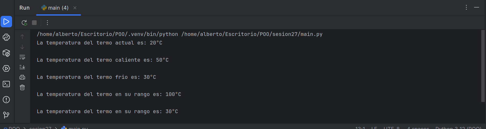

# El Termo Inteligente: 
Simulación de Control Climático en Python Descripción del Proyecto
Este repositorio contiene un proyecto que simula la lógica central de un termo inteligente. 
Su objetivo principal es demostrar cómo se pueden implementar sistemas automatizados para la gestión eficiente de la temperatura en un entorno controlado. 
Es un ejemplo ideal para entender sistemas de control básicos y la automatización programática.

# Características Principales

- Simulación de Temperatura: Permite establecer o simular una temperatura actual y objetivo.

- Lógica de Control: Implementa reglas para decidir cuándo encender/apagar un sistema de calefacción o refrigeración.

- Modos de Operación: Posiblemente conmutación entre modos (ej. manual, automático, ahorro).

- Optimización de Energía (Conceptual): Diseñado con principios para minimizar el consumo energético al mantener el confort.

- Interfaz Simple: Interacción a través de la consola para ajustes y visualización de estados.

## Impresion o ejecucion del programa

